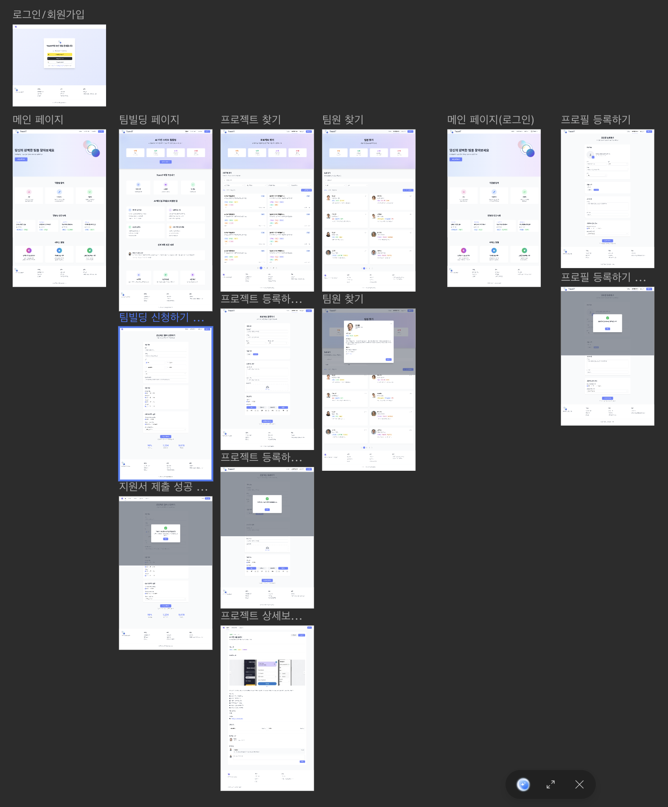
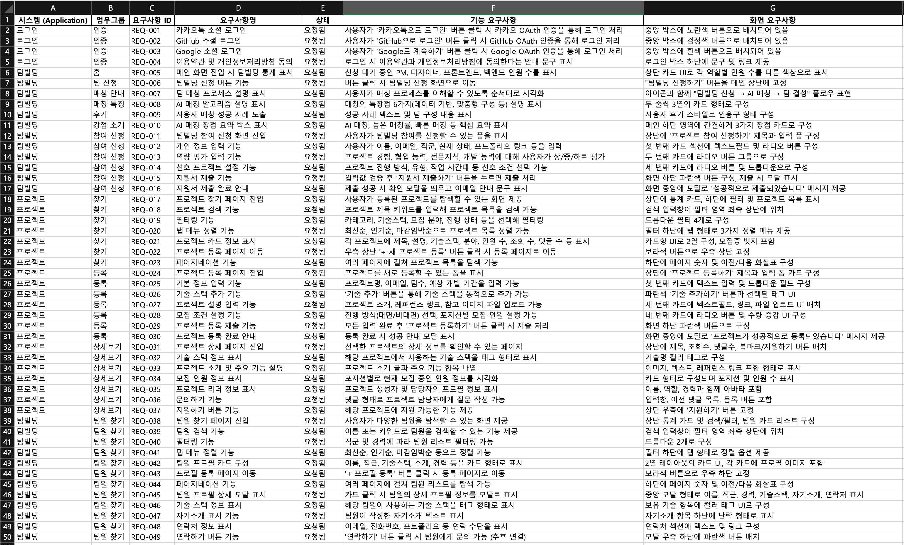
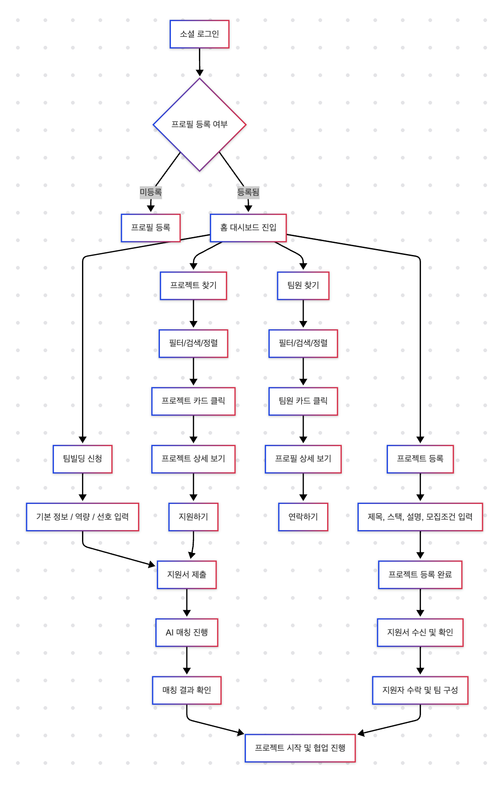

# 📘 TeamIT 프로젝트 개요서

## 프로젝트명
**TeamIT** – AI 기반 스마트 팀 빌딩 및 프로젝트 매칭 플랫폼

---

## 🧩 프로젝트 개요
TeamIT은 개발자, 디자이너, PM 등 다양한 직군의 사용자가 자신의 프로필을 등록하고,  
**프로젝트를 개설하거나 지원하여 팀을 구성할 수 있는 플랫폼**입니다.  
소셜 로그인부터 팀 구성, 지원, 커뮤니케이션까지의 전체 플로우를 **AI 기반 매칭 시스템**으로 제공합니다.

---

## 🚀 주요 기능

| 기능 영역           | 주요 기능 설명 |
|--------------------|----------------|
| 🔐 로그인/회원가입 | - 카카오, GitHub, Google 소셜 로그인 - 이용약관 및 개인정보 처리방침 동의 안내 |
| 🧠 팀빌딩 시스템    | - AI 기반 팀 구성 추천 - 팀 지원 신청 폼 - 역량 및 선호 기반 입력 - 팀 신청자 통계 카드 제공 |
| 📂 프로젝트 기능   | - 프로젝트 등록, 검색, 상세 조회 - 기술 스택, 설명, 모집 인원 설정 - 지원서 접수 및 문의 기능 |
| 👥 팀원 탐색 기능   | - 직군/경력 기준 필터링 및 정렬 - 팀원 프로필 카드 및 상세 모달 보기 - 연락 기능 및 프로필 등록 |
| 📈 사용자 인터랙션 | - 북마크, 댓글, 문의 등 기본 커뮤니케이션 기능 제공 |

---

## 🎯 대상 사용자

- 팀 프로젝트를 함께할 팀원을 찾고 싶은 **개발자, 디자이너, PM**
- 자신의 프로젝트를 개설하고 팀원을 모집하려는 **기획자 또는 리더**
- 자동화된 추천으로 효율적인 팀 구성을 원하는 **모든 사용자**

---

## 💡 기대 효과

- 사용자 맞춤형 **AI 매칭**으로 팀 구성 시간 절약
- **역량과 선호 기반**의 정밀한 프로젝트 탐색
- 실시간 커뮤니케이션으로 원활한 협업 연결
- 깔끔하고 직관적인 **UI/UX 경험**

---

## 🛠 개발 환경

- **Frontend**: React, Next.js, Tailwind CSS  
- **Backend**: FastAPI  
- **Database**: MongoDB, PostgreSQL  
- **인증**: OAuth 2.0 (카카오, GitHub, Google)  
- **배포**: Vercel / Render / AWS 등

---

## 🖼 화면 정의서  
[👉 화면 정의서 바로가기](https://creatie.ai/goto/IcGNJFA3?page_id=M&file=155042962707756)

---

## 📋 요구사항 정의서  
[👉 요구사항 정의서 바로가기](https://o365itc-my.sharepoint.com/:x:/g/personal/202045089_itc_ac_kr/ESC3IjPYmnZCl27xWR4IQW0B9IbEBiVDfKPXTzyo__eiOw?e=rogwkb)

---

## 🔄 사용자 워크플로우

